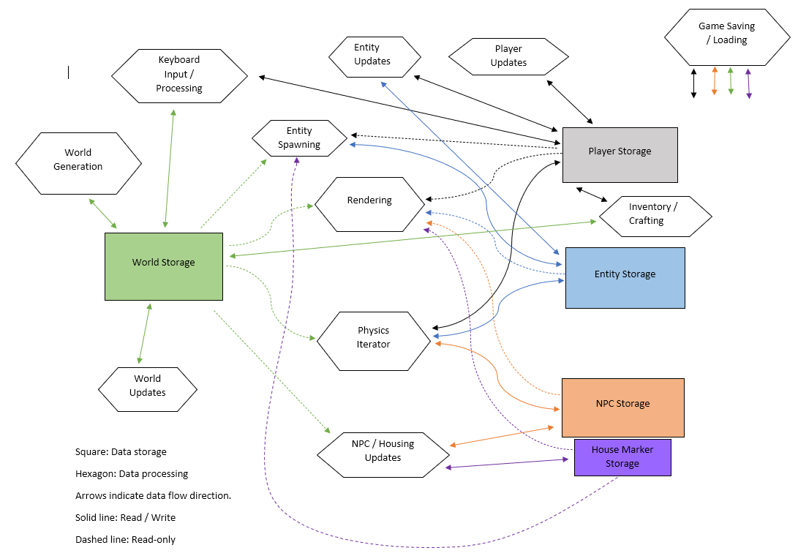

# Architecture

This document describes the high-level architecture of Terrario.

## Data Flow

The main game loop consists of working on data clumped in five main groups:

- World storage: All the world tiles, as well as chest inventories.
- Player storage: The player's current state, including their inventory.
- Entity storage: The current world entities.
- NPC storage: The world's NPCs.
- House Marker Storage: The world's house markers, both empty and occupied.

## Code Map

Important files. Additionally, the header files have descriptions of each exposed function.

### `entity`

Encompasses enemy behaviours, the physics iterator, and entity updates/spawning. Note that the iterator must be manually called for each physics property structure, done throughout the various update procedures.

### `generate`

Contains the world generation algorithm. Can be visualised at `util/maptool.py`.

### `npc`

Everything to do with both NPCs and house markers. 

### `render`

Takes care of both rendering the game and updating the scrolling window that holds tile variants. Also manages the particle explosion effect.

### `save`

Encompasses saving and loading the game from the calculator's storage memory.

### `update`

Manages keyboard input processing, updating the player's state, and updating non-static world tiles in the player's vicinity.

### `world`

Various functions for manipulating the world tiles.